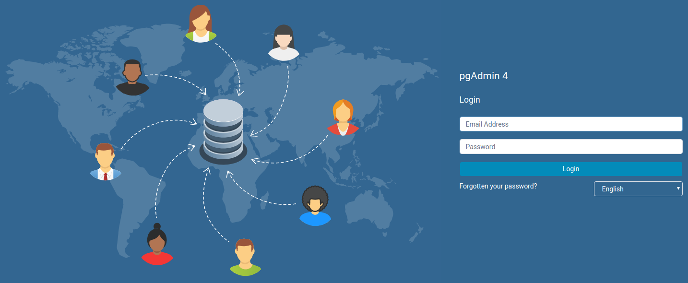
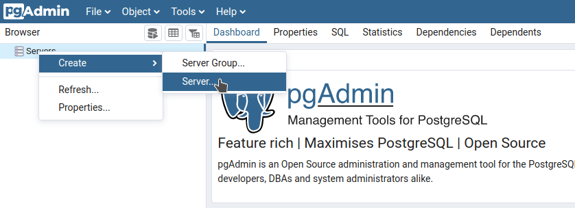
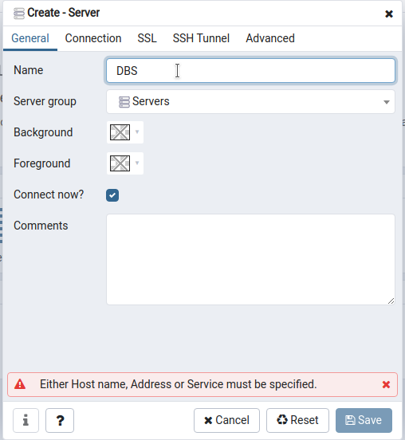
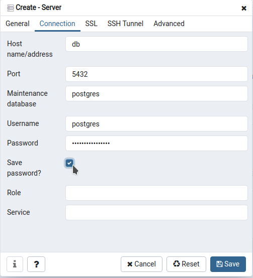
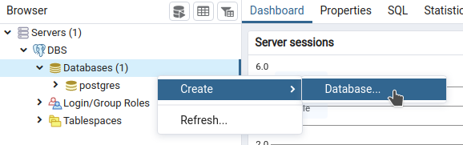
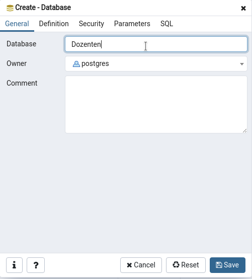
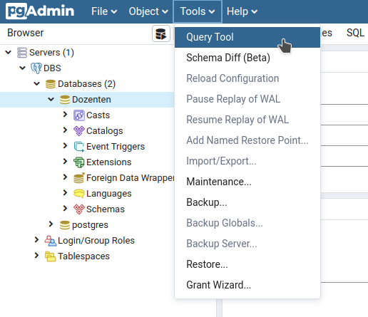
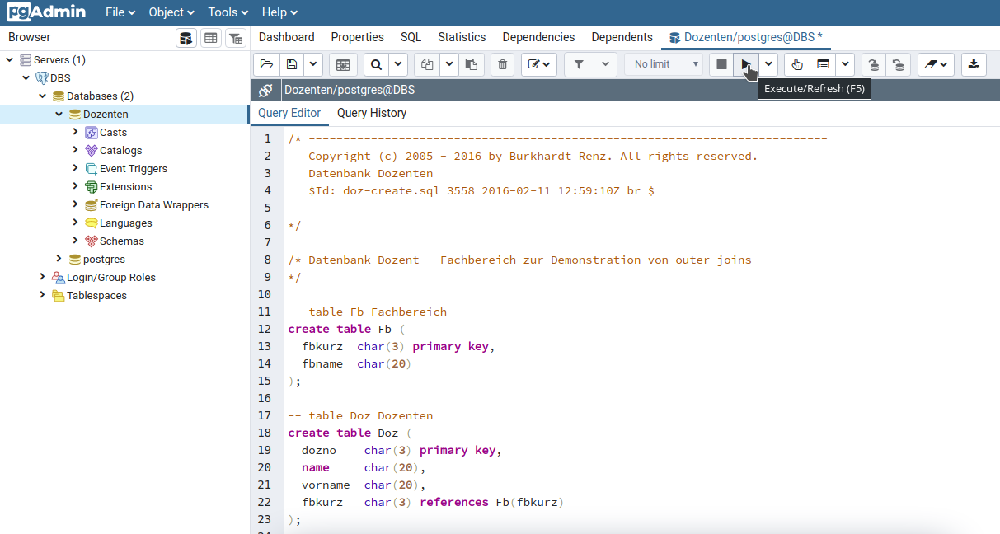

# Docker deployment of PgSQL and pgAdmin4 for DBS

## How to Start

First of all clone this repository using `git clone https://github.com/fmuenscher/postgres-dbs-docker.git` in your desired folder.

Mind that most Linux Distributions come with git preinstalled. If not, or if you are using Windows or mac, you need to install git first or simply download the repository as [ZIP](https://github.com/fmuenscher/postgres-dbs-docker/archive/master.zip).

### Linux

1. Install docker with the corresponding file in the `install docker` directory.
	* Use `sudo ./your-os.sh` to start the script.
1. Open the `docker-compose.override.yml` with your favourite text editor.
	1. Set the password for the default Postgres user
	1. Set the login information for pgAdmin4
	1. Save the file
1. Open a terminal in the main folder
1. Start the system by typing `docker-compose up`
1. Open [http://localhost:9000](http://localhost:9000) in your browser and log into pgAdmin4
1. Work with the database :)
1. To stop the system just press `Ctrl` + `C` in the terminal the system is running in.

### Windows

1. Install docker as explained [here](https://docs.docker.com/docker-for-windows/install/)
1. Open the `docker-compose.override.yml` with your favourite text editor.
	1. Set the password for the default Postgres user
	1. Set the login information for pgAdmin4
	1. Save the file
1. Open a PowerShell (not ISE) in the main folder
	1. This can be done by `Shift` + `Right click` in the explorer window ans selecting `Open Powershell`
1. Start the system by typing `docker-compose up`
1. Open [http://localhost:9000](http://localhost:9000) in your browser and log into pgAdmin4
1. Work with the database :)
1. To stop the system just press `Ctrl` + `C` in the terminal the system is running in.

### Mac

(Untested)

1. Install docker as explained [here](https://docs.docker.com/docker-for-mac/install/)
1. Open the `docker-compose.override.yml` with your favourite text editor.
	1. Set the password for the default Postgres user
	1. Set the login information for pgAdmin4
	1. Save the file
1. Open a terminal in the main folder
1. Start the system by typing `docker-compose up`
1. Open [http://localhost:9000](http://localhost:9000) in your browser and log into pgAdmin4
1. Work with the database :)
1. To stop the system just press `Ctrl` + `C` in the terminal the system is running in.

## Connect pgAdmin4 to PostgresDB

First log into pgAdmin4

After the login right click `Server` and select `Create` -> `Server...`

Give that Server a name :D and select `Connection`

Enter `db` as Host, `postgres` as user and your postgres password. Don't forget to select `Save password?`. Then click `Save`

Now you are back to the main page. Here right click `DBS` -> `Databases` and select `Create` -> `Database`

Of course your new db needs a name! Select a fitting one ;) Then click on `Save` once more.

Now you need to open the Query tool. Therefore select `Tools` -> `Query Tool`

Here you can simply paste the content of an `.sql` file and press `Play`. If it returns successfully, you have created your first Database :D

